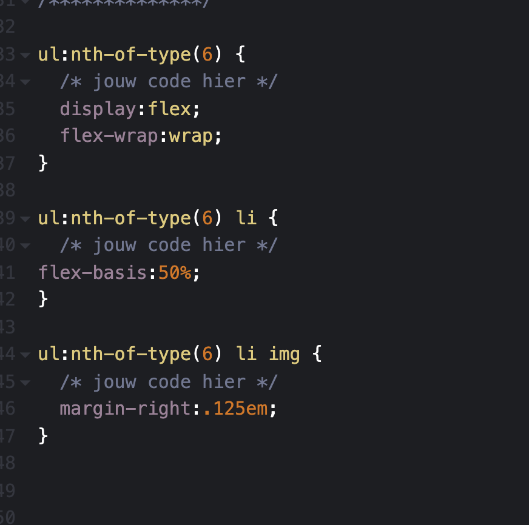

# Procesverslag
Markdown is een simpele manier om HTML te schrijven.  
Markdown cheat cheet: [Hulp bij het schrijven van Markdown](https://github.com/adam-p/markdown-here/wiki/Markdown-Cheatsheet).

Nb. De standaardstructuur en de spartaanse opmaak van de README.md zijn helemaal prima. Het gaat om de inhoud van je procesverslag. Besteedt de tijd voor pracht en praal aan je website.

Nb. Door *open* toe te voegen aan een *details* element kun je deze standaard open zetten. Fijn om dat steeds voor de relevante stuk(ken) te doen.

## Jij

uitwerken voor kick-off werkgroep

### Auteur:
Christiaan Dirven

#### Je startniveau:
Rood

#### Je focus:
Ik wil mij graag gaan focusen op de surface plane van FED
 

## Je website

uitwerken voor kick-off werkgroep

### Je opdracht:
https://www.nike.com/nl/en/

#### Screenshot(s) van de eerste pagina (small screen): 
startpagina  

#### Screenshot(s) van de tweede pagina (small screen):
schoenen pagina 

 

## Breakdownschets (week 1)

uitwerken na afloop 2e werkgroep

### de hele pagina: 

### dynamisch deel (bijv menu): 

## Voortgang 1 (week 2)

uitwerken voor 1e voortgang

### Stand van zaken
hier dit ging goed & dit was lastig (neem ook screenshots op van delen van je website en code)

Ik had deze week moeite met het begrijpen van flexbox, zo begreep ik niet zo goed hoe de 
diverse flex waarde's werkten zoals: justify-content en flex-basis. Nadat ik door de PDF
van de huiswerk opdracht was heengegaan, begreep ik de diverse waarde's van flexbox beter dan voorheen, aangezien het duidelijk werdt uitgelegd aan de hand van de opdrachten. Ik was echter wel een paar keer vastgelopen tijdens het maken van de huiswerkopdrachten, en heb toen de uitwerking bekeken om een beter begrip te krijgen van wat er van me werd verwacht.

### Agenda voor meeting
samen met je groepje opstellen

| student 1      | student 2          | student 3    | student 4        |
| ---            | ---                | ---          | ---              |
| dit bespreken  | en dit             | en ik dit    | en dan ik dat    |
| en dat ook nog | dit als er tijd is | nog een punt | dit wil ik zeker |
| ...            | ...                | ...          | ...              |

### Verslag van meeting
hier na afloop snel de uitkomsten van de meeting vastleggen

- Structuur aangebracht op mijn website
- Gewerkt met flexbox

## Voortgang 2 (week 3)

uitwerken voor 2e voortgang

### Stand van zaken

Deze week kregen we les over positioneren. Ik had hier erg veel moeite mee
aangezien ik het lastig vind om de orde te behouden als het aankomt op parent en
child elementen. De huiswerkopdrachten waren op zo'n manier gestructureerd dat het duidelijk
genoeg was om er voor het merendeel in m'n eentje uit te komen. Ik heb de dingen die ik van de huiswerkopdracht heb meegekregen al een klein beetje toegepast op mijn eigen website waar ik best wel trots op ben.

### Agenda voor meeting
samen met je groepje opstellen

| student 1      | student 2          | student 3    | student 4        |
| ---            | ---                | ---          | ---              |
| dit bespreken  | en dit             | en ik dit    | en dan ik dat    |
| en dat ook nog | dit als er tijd is | nog een punt | dit wil ik zeker |
| ...            | ...                | ...          | ...              |

### Verslag van meeting
hier na afloop snel de uitkomsten van de meeting vastleggen

- Ik heb eindelijk mijn opstelling goed kunnen krijgen
- Basis regels van mijn HTML besproken

## Toegankelijkheidstest (week 4)

uitwerken na test in 8e voortgang

### Bevindingen

Niet alle elementen konden met het toetsenbord
geselecteerd worden. Met name: het kruisje in het hamgurger menu en alle images die in het carousel zitten.

Hiernaast heb ik ook nog niet overal een active state aan toegevoegd wat het lastig maakt om te zien of een knop wel of niet al aangeklikt is.

#### Titel eerste bevinding

Toetsenbord toegankelijkheid.
Ik kwam erachter dat niet alle elementen in mijn website selectable waren met de tab toets. Toen ik samen met Sundous door mijn code heen was gegaan om te zien waar het aan lag, zagen we dat niet alle elementen binnen een "a" tag stonden zoals:  de elementen in het carousel. Dit heb ik toen direct opgelost waardoor nu alles binnen mijn website selecteerbaar is met de tab toets.

#### Titel tweede bevinding. 

Missende active state.
Sundous had tijdens de test opgemerkt dat niks binnen mijn website een active state had. Dit maakte het voor haar lastig om te zien welke knoppen ze nou had ingerdukt. Ik heb dat daarom ook tijdens de testsessie snel verbeterd waardoor het direct een stuk duidelijker werd om te zien welke knoppen geactiveerd waren.

## Voortgang 3 (week 4)

uitwerken voor 3e voortgang

### Stand van zaken
hier dit ging goed & dit was lastig (neem ook screenshots op van delen van je website en code)

De usability test ging deze week op zich best goed aangezien ik cruciale problemen binnen mijn website heb kunnen oplossen met de hulp van Sundous. Ik heb echter nog wel moeite om ervoor te zorgen dat het kruisje binnen mijn hamburgermenu selectable is met de tabtoets.

### Agenda voor meeting
samen met je groepje opstellen

| student 1      | student 2          | student 3    | student 4        |
| ---            | ---                | ---          | ---              |
| dit bespreken  | en dit             | en ik dit    | en dan ik dat    |
| en dat ook nog | dit als er tijd is | nog een punt | dit wil ik zeker |
| ...            | ...                | ...          | ...              |

### Verslag van meeting
hier na afloop snel de uitkomsten van de meeting vastleggen

- alles toetsenbord interactief gemaakt dmv tabindex
    (dit was achteraf gezien niet nodig geweest aangezien het probleem opgelost kon worden door de button uit de "a" tag te halen.)

## Eindgesprek (week 5)

uitwerken voor eindgesprek

### Stand van zaken
Ik ben erg trots met mijn uiteindelijke variatie van de Nike site aangezien ik aan het begin van FED heel veel moeite had met het herleren van alle codeer principe's. Dat wil echter niet zeggen dat ik het nu veel makkelijker vind, aangezien coderen van nature niet mijn sterkste punt is. Ik ben ook trots op mezelf dat ik het zover heb gemaakt, en dat ik coderen uiteindelijk best wel leuk vond toen ik het begreep.

(Wat ik heb meegenomen uit het eindgesprek. Ik had een aantal foutjes gemaakt rondom het positioneren van elementen, met name: het scrollbare menu aan de bovenkant van de tweede pagina en het kruisje in mijn hambrugermenu. Zo had ik namelijk alleen het plaatje van het kruisje als "fixed" gepositioneerd, i.p.v. de gehele button, wat inhield dat het plaatje uit de parent was gehaald waardoor de button niet meer om het plaatje heenzat. Daardoor kon het dus niet met de tabtoets geselecteerd worden. Ook had ik een foutje gemaakt bij het scrollbare menu dat aan de bovenkant van de tweede pagina te zien was, aangezien je het menu alleen maar kon scrollen als je erop klikte (in tegenstelling tot een vergelijkbaar scrollmenu aan de onderkant van de pagina) De oorzaak hiervan bleek uiteindelijk de nav te zijn met position absolute. Hierdoor ging de nav uit de flow waardoor wat onder de nav zat, de nav naar boven schuift en er ook deels over heen gaat.Ook bedekte de padding van deze h2 het scrollmenu waardoor je alleen maar kon scrollen als je met je muis boven de padding van de h2 zat.)

### Screenshot(s)

hier screenshot(s) van je eindresultaat

## Bronnenlijst

continu bijhouden terwijl je werkt

Nb. Wees specifiek ('css-tricks' als bron is bijv. niet specifiek genoeg).

1. https://codepen.io/shooft/pen/abwLyvm
2. https://codepen.io/shooft/pen/VwWjVRa
3. https://developer.mozilla.org/en-US/
4. https://stackoverflow.com/
5. https://codepen.io/shooft/pen/mdwroZE
6. https://codepen.io/shooft/pen/PojGBYo
7. https://codepen.io/shooft/pen/KKqMPqN

